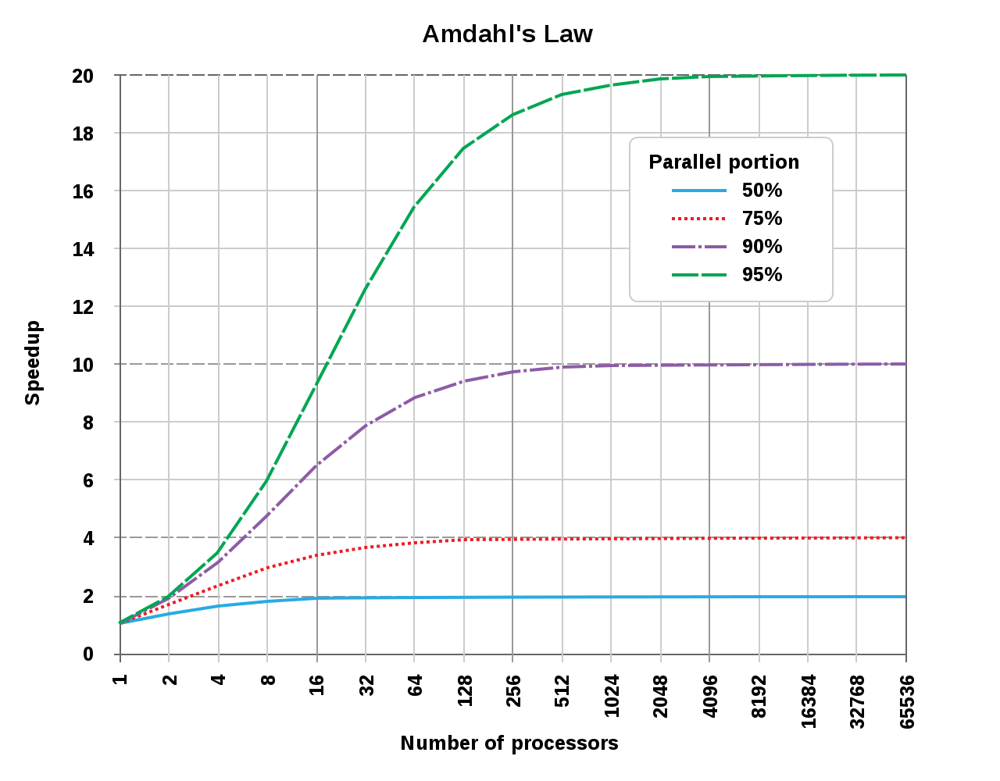

<!-- .slide: data-background-color="#353535" class="center color" style="text-align: left;" -->

### Parallel Workloads

- Eirik Albrigtsen : [github.com/clux](https://github.com/clux) 
- [clux.dev](https://clux.dev) / [@sszynrae](https://twitter.com/sszynrae)

- Babylon Health : [github.com/Babylonpartners](https://github.com/Babylonpartners)


NOTES:
- Hi. Eirik / clux online. Have these urls.
- Talk: Talking a little bit about parallelism, iterator patterns, and some elegant functional solutions to one sample problem.
- Hopefully will contain some ideas to help speed up your code today, and how you can make it even better with futures in the future.

---
<!-- .slide: data-background-color="#333" -->


<a style="font-size: 30px; float: right; margin-top: 620px" href="https://github.com/Babylonpartners/shipcat">github:shipcat</a>

notes:
- write rust for these guys in this building. big open source thing i work a lot on is `shipcat`
- which defines what a microservice is, how controls how to deploy it to k8s => our defacto helm replacement in rust.
- talk about one solution from it because it illustrates the different approaches well.
- code all available online, simplified examples herein.
- TL;DR we have close to half a thousand microservices config managed in one huge repo. To avoid congestion; We validate all of those on every merge with a super tight rust loop.

---
<!-- .slide: data-background-color="#353535" class="center color" style="text-align: left;" -->
Problem - imperative:

```rust
fn validate() -> Result<Vec<Manifest>> {
    let svcs = shipcat::list_services()?;
    let mut manifests = vec![];
    for s in svcs {
        let mf = shipcat::load(s)?;
        mf.verify()?;
        manifests.push(mf);
    }
    Ok(manifests)
}

type Result<T> = std::result::Result<T, Error>;
```

notes:
- Find all subdirs, load one file in each using serde
- Load all files in that subdir, merge manifest for the relevant region, load its templates, then verify them (sequential, tons of disk IO)
- return all verified manifests
- bail on any errors (BAD)
- for simplicity, ignore second arg, assumee some Error type (chain/failure)
- towards parallism: define unit - fn!

---
<!-- .slide: data-background-color="#353535" class="center color" style="text-align: left;" -->
Iter -> map -> colllect

```rust
fn validate() -> Result<Vec<Manifest>> {
    let svcs = shipcat::list_services()?;
    svcs.into_iter()
        .map(|s| {
            let mf = shipcat::load(s)?;
            mf.verify()?;
            Ok(mf)
        }).collect()
}
```

notes:
- same behaviour - body of for loop into map
- need to return Result because was using ? in body => Ok
- collect vec of results into result of vec
- fails entire operation on first errors (same behavior)

---
<!-- .slide: data-background-color="#353535" class="center color" style="text-align: left;" -->
Iter -> map -> colllect (factor out result fn)

```rust
fn validate() -> Result<Vec<Manifest>> {
    let svcs = shipcat::list_services()?;
    svcs.into_iter()
        .map(|s| Ok(load_and_verify(s)?))
        .collect()
}
fn load_and_verify(s: &str) -> Result<Manifest>;
```
<a>-</a>

notes:
- note the pointless questionmark inside an Ok, is that pointless?
- Error::into!


---
<!-- .slide: data-background-color="#353535" class="center color" style="text-align: left;" -->
Iter -> map -> colllect (factor out result fn)

```rust
fn validate() -> Result<Vec<Manifest>> {
    let svcs = shipcat::list_services()?;
    svcs.into_iter()
        .map(|s| load_and_verify(s))
        .collect()
}
fn load_and_verify(s: &str) -> Result<Manifest>;
```
<a>-</a>

notes:
- if load_and_verify has a compatible Error type (assuming that)


---
<!-- .slide: data-background-color="#353535" class="center color" style="text-align: left;" -->
Iter -> map -> colllect (factor out result fn)

```rust
fn validate() -> Result<Vec<Manifest>> {
    let svcs = shipcat::list_services()?;
    svcs.into_iter()
        .map(load_and_verify)
        .collect()
}
fn load_and_verify(s: &str) -> Result<Manifest>;
```

<a class="fragment" href="https://doc.rust-lang.org/stable/rust-by-example/error/iter_result.html">rust-by-example: iterating over Result</a>

notes:
- if load_and_verify has the same signature as map expects: ONE ARG
- NOW: We want to do better error handling.
- MIDSLIDE: Rust-by-example suggests filter_map
- But also want the successes if it worked for further processing!

---
<!-- .slide: data-background-color="#353535" class="center color" style="text-align: left;" -->
Iter -> map -> partition (incomplete)

```rust
fn validate() -> Result<Vec<Manifest>> {
    let svcs = shipcat::list_services()?;
    let (oks, errs) : (Vec<_>, Vec<_>) = svcs.into_iter()
        .map(load_and_verify)
        .partition(Result::is_ok)
```

notes:
- boolean condition fn that dictates left or right
- returns a pair of collections (forcing to vec)
- partition force you to go through every item
- types here? -> Result :/

---
<!-- .slide: data-background-color="#353535" class="center color" style="text-align: left;" -->
Iter -> map -> partition

```rust
fn validate() -> Result<Vec<Manifest>> {
    let svcs = shipcat::list_services()?;
    let (oks, errs) : (Vec<_>, Vec<_>) = svcs.into_iter()
        .map(load_and_verify)
        .partition(Result::is_ok)
    errs.into_iter().collect::<Result<Vec<_>>>()?;
    let oks = okrs.into_iter().map(Result::unwrap).collect();
    Ok(oks)
}
```

notes:
- need to unwrap and unwrap_err :/
- unwrap_err actually require Debug impl - so am just collecting
- Too much boilerplate. Want to keep unwrap to minimum!
- thankfully, as filter has filter_map, partition has:

---
<!-- .slide: data-background-color="#353535" class="center color" style="text-align: left;" -->
Iter -> map -> partition_map

```rust
fn validate() -> Result<Vec<Manifest>> {
    let svcs = shipcat::list_services()?;
    let (errs, oks) : (Vec<Error>, Vec<_>) = svcs.into_iter()
        .map(load_and_verify)
        .partition_map(|r| match r {
            Err(e) => Either::Left(e),
            Ok(o) => Either::Right(o),
        });
    for e in errs {
        return Err(e);
    }
    Ok(oks)
}
use itertools::{Itertools, Either};
```

notes:
- itertools give you `partition_map` and `Either`
- types now correct, no unwrap. like if-let!
- Either is equivalent to Result in some sense; 2-part enums over 2 generic types, where 1 goes in the first el, and 2 in the second el.


---
<!-- .slide: data-background-color="#353535" class="center color" style="text-align: left;" -->
Iter -> map -> partition_map

```rust
fn validate() -> Result<Vec<Manifest>> {
    let svcs = shipcat::list_services()?;
    let (errs, oks) : (Vec<Error>, Vec<_>) = svcs.into_iter()
        .map(load_and_verify)
        .partition_map(Either::from);
    for e in errs {
        return Err(e);
    }
    Ok(oks)
}
```

```rust
// Convert from Result to Either
// with Ok => Right and Err => Left.
impl<L, R> From<Result<R, L>> for Either<L, R>
```

notes:
- Can convert From a Result to an Either
- Might look a little weird (partition map to an either from result)
- Super easy to focus on the error handling now!
- Same example. Still just stops on first errors (but runs all)

---
<!-- .slide: data-background-color="#353535" class="center color" style="text-align: left;" -->
Iter -> map -> partition_map

```rust
fn validate() -> Result<Vec<Manifest>> {
    let svcs = shipcat::list_services()?;
    let (errs, oks) : (Vec<_>, Vec<_>) = svcs.into_iter()
        .map(load_and_verify)
        .partition_map(Either::from);
    if !errs.is_empty() {
        for e in &errs {
            error!("{}", e);
            debug!("{:?}", e);
        }
        bail!("Invalid manifests in {} files", errs.len());
    }
    Ok(oks)
}
```

notes:
- CLI use case here; error description (Display) using `error!`
- Debug (trace with error-chain) using `debug!`
- This is the type of error handling here!
- All at the end > in the middle of a big imperative loop
- Avoids interleaving when we switch to parallel mode!
- Error handling. Koan: Nicer code => worse error handling

---
<!-- .slide: data-background-color="#353535" class="center color" style="text-align: left;" -->
Iter -> map -> partition_map (sequential)

```rust
fn validate() -> Result<Vec<Manifest>> {
    let svcs = shipcat::list_services()?;
    let (errs, oks) : (Vec<_>, Vec<_>) = svcs.into_iter()
        .map(load_and_verify)
        .partition_map(Either::from);
    handle_errs(errs)?;
    Ok(oks)
}
fn handle_errs(errs: Vec<Error>) -> Result<()>;
```

notes:
- factor out the error handling!
- to a fn that returns Err when the vector is non-empty!
- now that we've done the abstraction rabit hole, let's parallelize:

---
<!-- .slide: data-background-color="#353535" class="center color" style="text-align: left;" -->
Iter -> map -> partition_map (parallel)

```rust
fn validate() -> Result<Vec<Manifest>> {
    let svcs = shipcat::list_services()?;
    let (errs, oks) : (Vec<_>, Vec<_>) = svcs.par_iter()
        .map(load_and_verify)
        .partition_map(Either::from);
    handle_errs(errs)?;
    Ok(oks)
}
use rayon::{iter::Either, prelude::*};
```

notes:
- rayon includes `Either` + itertools!
- RAYON_NUM_THREADS == num_cores (logical with HT)
- (data parallelism for io stuff - plz ignore)
- Suppose measured pre parallel. 20s total, 2s in list_services
- How much speedup on 100 cores? Amdahl => only 10

---


notes:
- speedup we can get from parallel iteration limited by the sequential part
- can cheat here by setting num threads to 20 in rayon (because most io bound)
- actually a bit bad practice to use rayon for non-data
- should use message passing on top of own `threadpool`
- https://docs.rs/threadpool/1.7.1/threadpool/
- end result that thread pool on IO not super smart. CONSIDER:

---
<!-- .slide: data-background-color="#353535" class="center color" style="text-align: left;" -->
unix equivalent

```rust
// shipcat list-services
shipcat::list_services()

// shipcat validate $@..
fn validate(svcs: Vec<String>) -> Result<Vec<Manifest>> {
    svcs.iter().map(load_and_verify).collect()
}
```

```sh
shipcat validate $(shipcat list-services)
shipcat list-services | xargs shipcat validate
shipcat list-services | xargs -P 20 -n 20 shipcat validate
```

notes:
- suppose serial step in one command
- remove par part, do it sequentially (though worse error handling)
- pipe that in batches to a fn that takes arguments
- args == imperative perf, xargs (400 calls) tiny bit worse
- xargs -P batches 400 into 20x20
- rayon not much better than this: measured 10% better (worse error handling)
- if interested in tuning:

---
<!-- .slide: data-background-color="#353535" class="center color" style="text-align: left;" -->
[Performance Matters - Emery Berger](https://www.youtube.com/watch?v=r-TLSBdHe1A)
<br>
<small>StrangeLoop September 2019</small>

notes:
- scientifically speed-ups! (cpp/rust, cache misses + layouts matter)
- but ultimately we're just choking on threads that are blocking here
- at a certain point there's an overhead to spawning more threads
- using those threads better or having a better algorithm more important

---
<!-- .slide: data-background-image="./hypnotoad.webp" data-background-size="100% auto" class="color"-->

notes:
- async is to going to solve everything
- nothing blocking, so can work with less threads with same effect
- having your thread pool know when it can resume (Waker)
- really: core of async: allowing smarter use of threads!
- BUT: my examples here are a little speculative

---
<!-- .slide: data-background-color="#353535" class="center color" style="text-align: left;" -->
futures - what we have (1.39)

- only [std::task](https://doc.rust-lang.org/std/task/index.html) and [std::future](https://doc.rust-lang.org/std/future/index.html)
- [core::future::Future trait](https://doc.rust-lang.org/nightly/core/future/trait.Future.html)
- async keyword, Pin api
- [areweasyncyet](https://areweasyncyet.rs/)

notes:
- tasks, what is your workload
- futures, what your workload is meant to return
- hairy low level stuff - on which you can build a runtime
- suspect i might not touch these much
- took a long time to decide - incredibly complicated api decisions you can read about via arewesyncyet

---
<!-- .slide: data-background-color="#353535" class="center color" style="text-align: left;" -->
streams - what we can experiment with

- async iterator or streams == unresolved
- [future/FutureExt trait](https://rust-lang-nursery.github.io/futures-api-docs/0.1.27/futures/future/trait.FutureExt.html)
- [futures/stream/trait.Stream](https://docs.rs/futures-preview/0.3.0-alpha.18/futures/stream/trait.Stream.html)
- [tokio::stream::StreamExt](https://docs.rs/tokio/0.2.0-alpha.5/tokio/stream/trait.StreamExt.html)
- [async_std/stream/trait.Stream](https://docs.rs/async-std/0.99.6/async_std/stream/trait.Stream.html)

notes:
- unlikely to be stable for some time
- but useful showcases available
- everything build on FutureExt (not stabilized)
- "If Future T is an async version of T, then Stream T is an async version of Iterator T"
- tokio almost using std::future in their 0.2 (can throttle - tiller)
- async-std is really experimenting with streams (can collect)

---
<!-- .slide: data-background-color="#353535" class="center color" style="text-align: left;" -->
Iter -> map -> partition_map (parallel)

```rust
fn validate() -> Result<Vec<Manifest>> {
    let svcs = shipcat::list_services()?;
    let (errs, oks) : (Vec<_>, Vec<_>) = svcs.par_iter()
        .map(load_and_verify)
        .partition_map(Either::from);
    handle_errs(errs)?;
    Ok(oks)
}
fn load_and_verify(s: &str) -> Result<Manifest>;
fn handle_errs(errs: Vec<Error>) -> Result<()>;
```

notes:

- Recap. Depend on 3 functions that are sync. Listed 2 below.
- If partition_map makes it into async_std (or tokio) then:

---
<!-- .slide: data-background-color="#353535" class="center color" style="text-align: left;" -->
Iter -> stream -> map -> partition_map

```rust
async fn validate() -> Result<Vec<Manifest>> {
    let svcs = shipcat::list_services().await?;
    let (errs, oks) : (Vec<_>, Vec<_>) = stream::iter(svcs)
        .map(load_and_verify)
        .partition_map(Either::from).await;
    handle_errs(errs)?;
    Ok(oks)
}
async fn load_and_verify(s: &str) -> Result<Manifest>;
fn handle_errs(errs: Vec<Error>) -> Result<()>;
```

notes:
- propagate futures all the way down, all file-io
- wait for async-std/tokio to provide nice combinators
- collect already exists on async stream inside async-std (Thursday)
- more efficient than rayon already; thread pool more effective at context switching

---
<!-- .slide: data-background-color="#353535" class="center color" style="text-align: left;" -->
iter -> stream

```rust
    let svcs = shipcat::list_services().await?;
    let (errs, oks) : (Vec<_>, Vec<_>) = stream::iter(svcs)
        .map(load_and_verify)
        .partition_map(Either::from).await;
```

notes:
- we await a complete vector here..
- then turn that into a stream via iter
- what if we just started with a stream?

---
<!-- .slide: data-background-color="#353535" class="center color" style="text-align: left;" -->
stream -> stream!

```rust
    let svcs = shipcat::list_services();
    let (errs, oks) : (Vec<_>, Vec<_>) = svcs
        .map(load_and_verify)
        .partition_map(Either::from).await;
```

notes:
- if list_services returned a stream!
- avoids speedbump from amdahls law!
- pervasive makes more code paralleliseable!

---
<!-- .slide: data-background-color="#353535" class="center color" style="text-align: left;" -->
dream

```rust
async fn validate() -> Result<Vec<Manifest>> {
    let svcs = shipcat::list_services();
    let (errs, oks) : (Vec<_>, Vec<_>) = svcs
        .map(load_and_verify)
        .partition_map(Either::from).await;
    handle_errs(errs)?;
    Ok(oks)
}
```

notes:
- would very much like my code to look like this.
- it doesn't.

---
<!-- .slide: data-background-color="#353535" class="center color" style="text-align: left;" -->

- Eirik Albrigtsen : [github.com/clux](https://github.com/clux)

- [clux.dev](https://clux.dev) / [@sszynrae](https://twitter.com/sszynrae)

- Babylon Health : [github.com/Babylonpartners](https://github.com/Babylonpartners)


